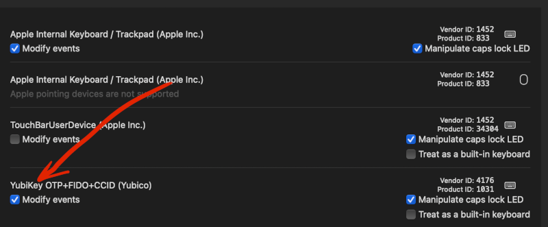
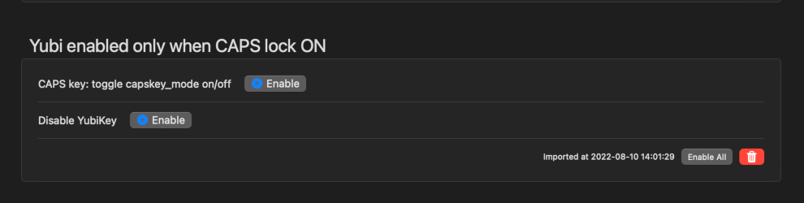

# YubiKill

### tl;dr 
Karabiner Elements .json file to enable YubiKey output only with a modifier key (caps lock) pressed. This prevents you chatting to people fjsdjhkjahsdkjahslkjsdhgskjdvnskdbvsjkdb.

### Installing

1. Install [Karabiner Elements](https://karabiner-elements.pqrs.org)

2. Enable modifying YubiKey output in preferences

3. Make sure your VID/PID for the Yubikey (above) match those in the JSON file.

4. Copy the yubi.json file to your ~/.config/karabiner/assets/complex_modifications

5. Add the modifications under "complex modifications" in preferences

6. Make sure both are enabled

7. Profit! 

- Caps Lock + yubikey = sliqmnoianwiiwmdoqnsknfoisjjd
- Yubikey alone = ignored
